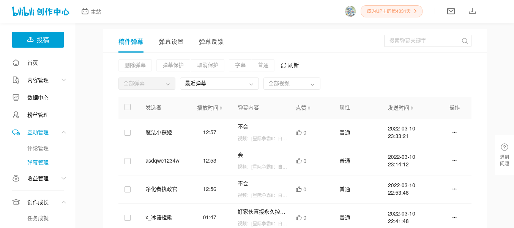
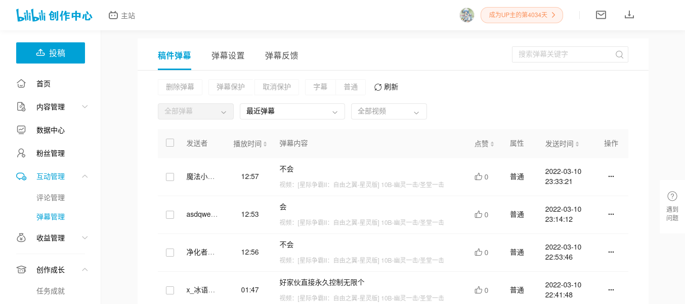
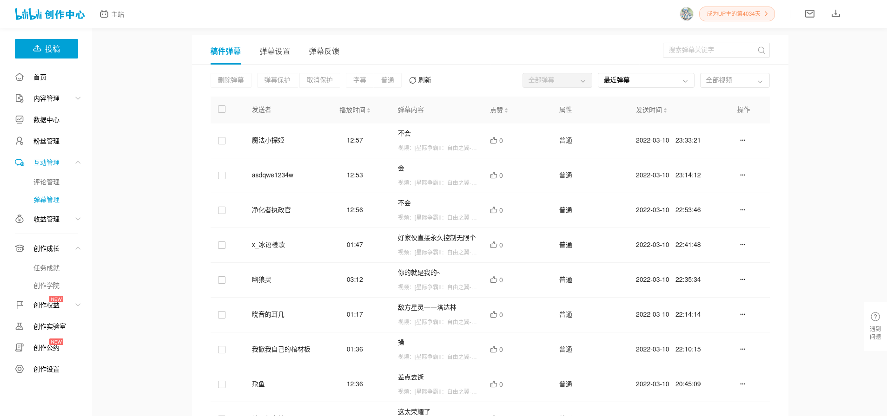
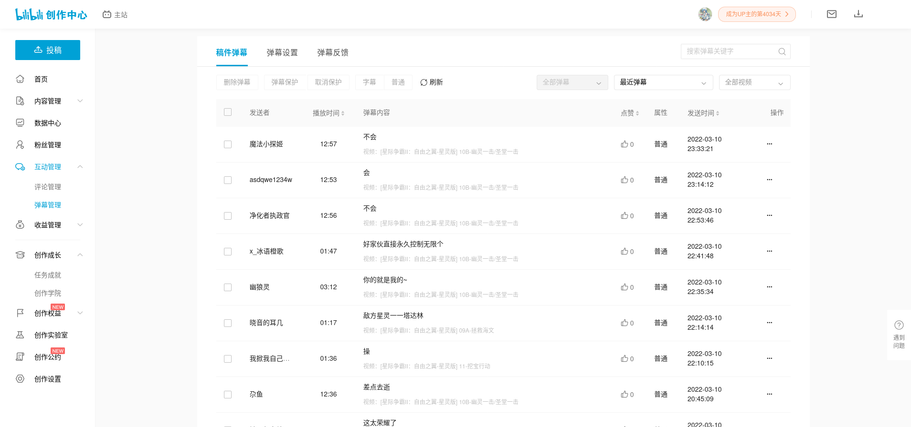

# better-bilibili-inter-active-danmu-typographic

[简体中文 README](README_zh-cmn-Hans.md)

Greasy Fork: <https://greasyfork.org/zh-CN/scripts/441322>

## Screenshot

### On screen 1366x768

- Before

- After

### On screen 1920x1080

- Before

- After

## License

This project is licensed under **GNU AFFERO GENERAL PUBLIC LICENSE Version 3**
